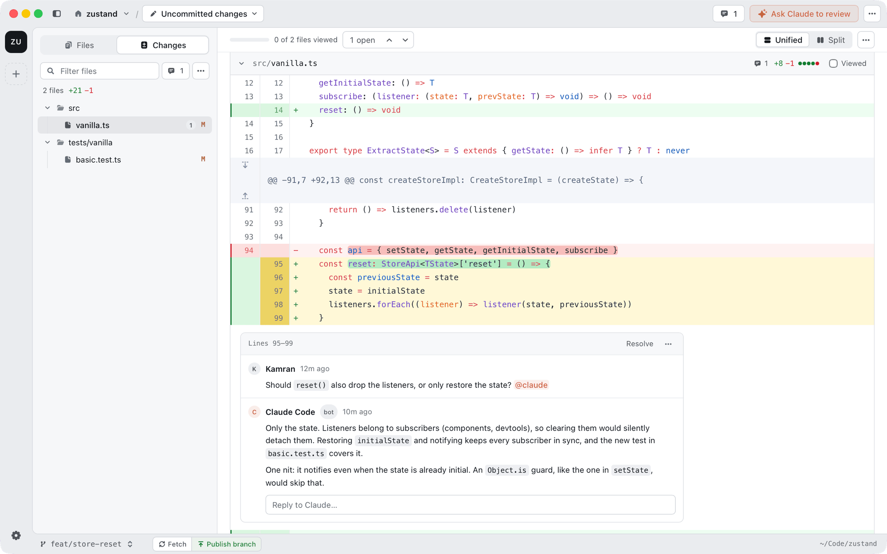
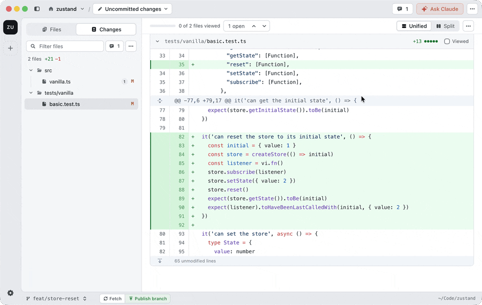
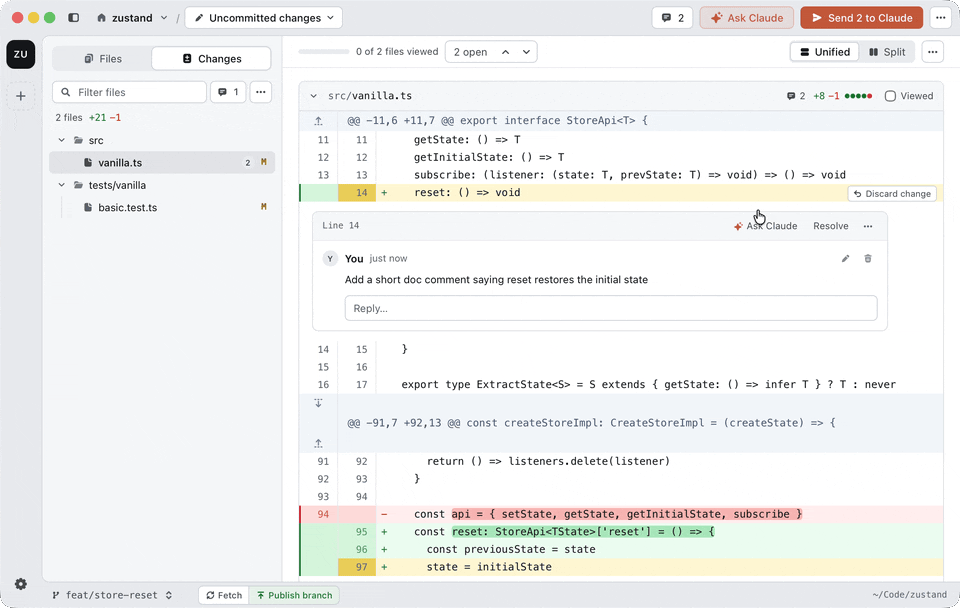
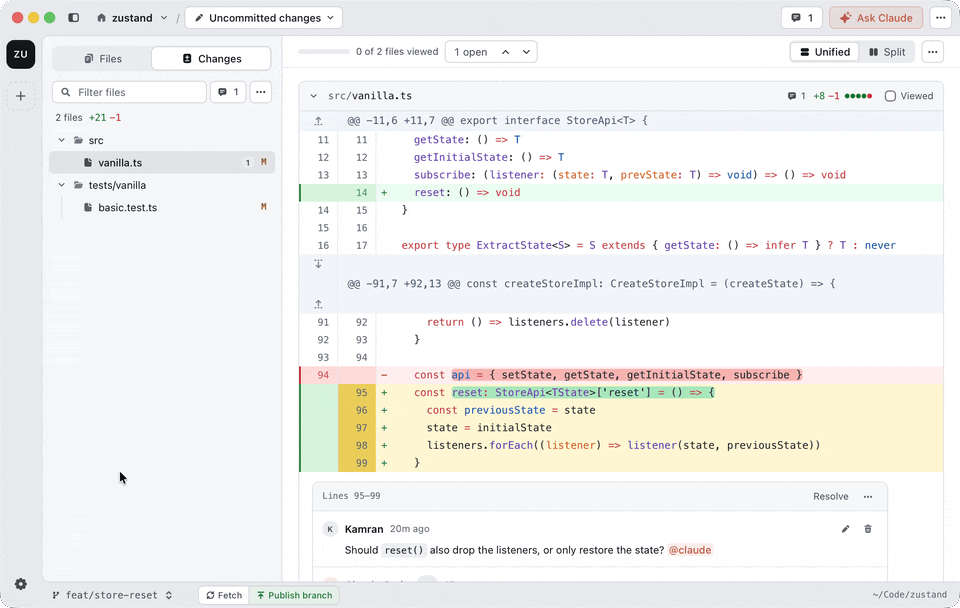
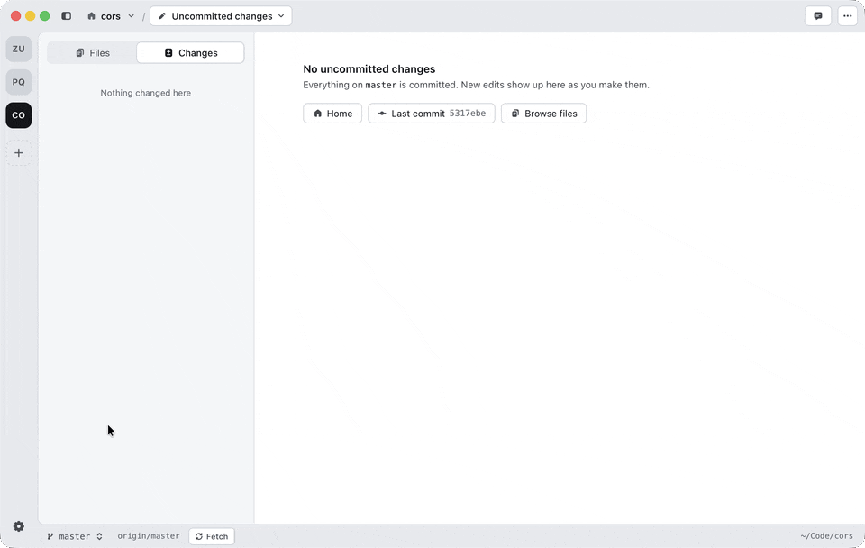
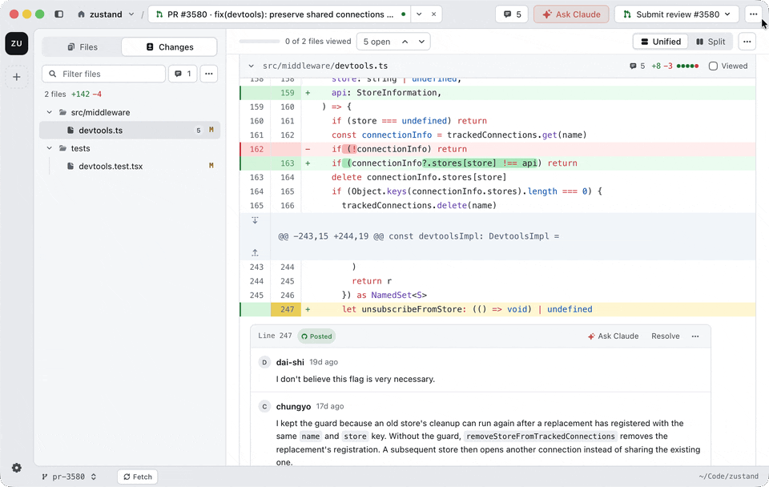
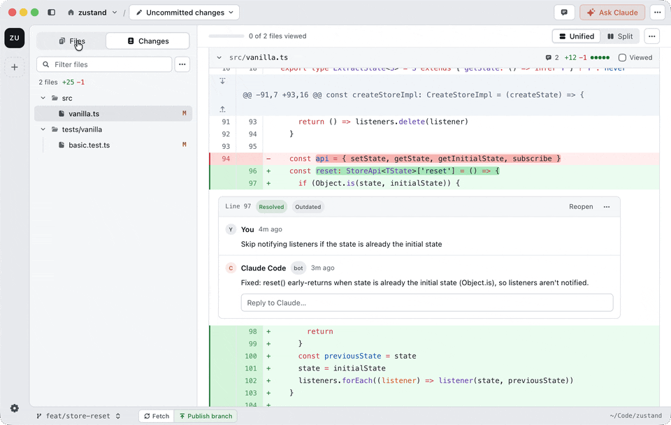
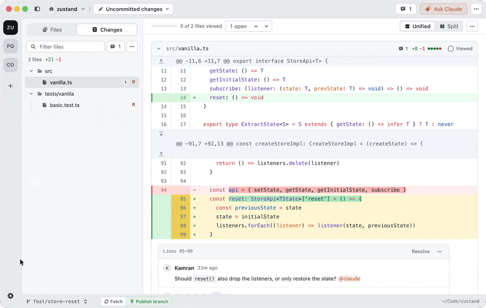
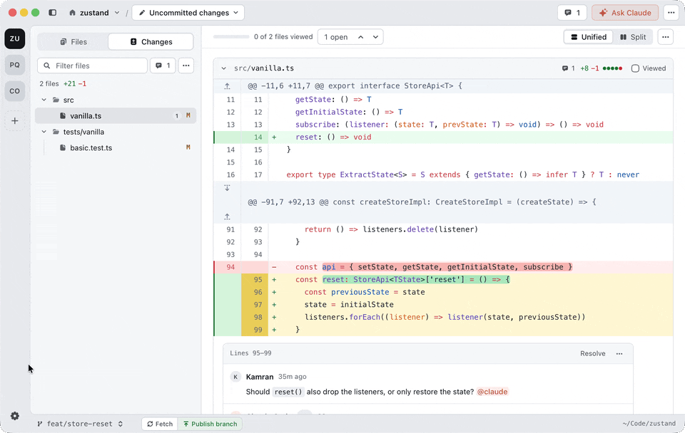
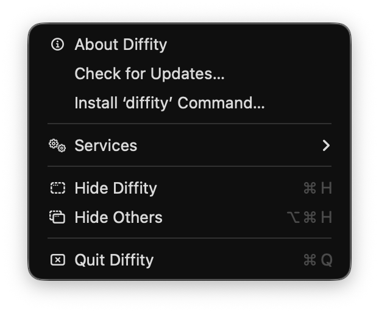

# diffity

[](https://github.com/nilbuild/diffity/releases/latest)
[](https://github.com/nilbuild/diffity/releases/latest)
[](./LICENSE)

Diffity is a Mac app for reviewing code changes, yours or your agent's, GitHub-style, with Claude Code in the loop.



[](https://github.com/nilbuild/diffity/releases/latest)
[](https://github.com/nilbuild/diffity/issues/new/choose)

macOS 13.3 or later, Apple Silicon and Intel. The AI features need [Claude Code](https://docs.claude.com/en/docs/claude-code) (logged in) and Node.js.

| What can you do? | Description |
|---|---|
| [Comment on your diff](#comment-on-your-diff) | Leave comments on lines, files or the whole diff, then send them to Claude to fix |
| [Let Claude fix your comments](#let-claude-fix-your-comments) | Claude works through your comments, edits the code and replies in each thread |
| [Ask @claude](#ask-claude) | Mention @claude in any thread and Claude replies right there |
| [Get a Claude review](#get-a-claude-review) | Claude reads the diff and leaves comments on the lines it cares about |
| [Review any commit or range](#review-any-commit-or-range) | Uncommitted changes, a commit, a range or a whole branch |
| [Review pull requests](#review-pull-requests) | Check out a GitHub PR, review it locally, post the review back |
| [Post reviews to GitHub](#post-reviews-to-github) | Submit as Comment, Approve or Request changes, with GitHub threads synced into the diff |
| [Browse and comment on any file](#browse-and-comment-on-any-file) | Comment on code outside the diff from the Files tab |
| [Jump anywhere](#jump-anywhere) | ⌘P for files, ⌘K for commits, comments, PRs and every action |
| [Switch projects](#switch-projects) | Keep your repos in a rail and switch with ⌘1–9 |
| [Open from the terminal or your agent](#open-from-the-terminal-or-your-agent) | `diffity` opens a repo, a diff or a pull request URL in the app |

### Comment on your diff

> Drag across line numbers or click the `+` in the gutter, write a comment, then hit **Send to Claude** to have it fix them.



### Let Claude fix your comments

> Hit **Send N to Claude**; it works through each comment, edits the code and replies in the thread, and you review its changes like any other diff.



### Ask @claude

> Type `@claude` in any comment or reply and Claude answers in the same thread.



### Get a Claude review

> Click **Ask Claude to review**, optionally add what to focus on, and its comments land on the diff as it works.


### Review any commit or range

> Open the picker next to the project name to switch between uncommitted changes, a commit, a range or a branch.


### Review pull requests

> Pick a PR from the branch switcher to check it out, comment as you read, then **Submit review** to post it to GitHub.



### Post reviews to GitHub

> Comment as you read, then **Submit review** as Comment, Approve or Request changes; GitHub comments sync back into the diff so you can reply or resolve from the app.



### Browse and comment on any file

> Open the **Files** tab, pick any file in the repo and comment on its lines, even code the diff doesn't touch.



### Jump anywhere

> Press `⌘P` to open any file, or `⌘K` to search commits, comments, PRs and every action.



### Switch projects

> Open a repo with `⌘O`; it stays in the left rail, so `⌘1`–`⌘9` takes you back to it.



### Open from the terminal or your agent

> Run `diffity` in any repository to open it in the app, or pass a pull request URL to review it.

Install the command once from the app menu: **Diffity → Install ‘diffity’ Command…**. It links the command into `/usr/local/bin` and asks for your password if that folder needs it.



```sh
diffity                                        # uncommitted changes in the current repository
diffity ~/code/app                             # another repository
diffity --ref main                             # everything on this branch since it left main
diffity --ref HEAD~1..HEAD                     # the last commit
diffity https://github.com/owner/repo/pull/42  # check out and review a pull request
diffity src/app.ts                             # a file in the Files tab
diffity -n                                     # in a new window
```

`--ref` takes anything the ref picker does: `work`, `staged`, `unstaged`, a branch or commit, `<a>..<b>` or `<a>...<b>`. A pull request opens in the current repository if it is a clone of that repo, else in a clone Diffity already knows; with neither, Diffity offers to clone it. Run `diffity --help` for everything.

Coding agents can run it too, so you can ask Claude Code to “open your changes in Diffity” before it opens a PR.

### More

- **Find in the whole diff.** `⌘F` searches every file in the diff, including collapsed ones, and `⌘G` jumps to the next match.
- **Changed since you viewed it.** Files you marked Viewed get a badge when they change again, and one click shows just what changed.
- **Hide generated files.** Add a `.diffityignore` to your repo (same syntax as `.gitignore`), or a list in Settings, and those files stay out of your diffs:

  ```gitignore
  dist/
  *.generated.ts
  !dist/keep-me.js
  ```
- **Colour-blind friendly colours.** Settings → General → Appearance switches the diff to blue and orange, in light and dark.
- **Split or unified, light or dark.** Toggle the diff layout anytime; the theme follows your Mac unless you pick one in Settings.
- **Updates itself.** New versions install in place, and What's New in the Help menu shows what changed.

Found a bug or have an idea? [Open an issue](https://github.com/nilbuild/diffity/issues/new/choose).

## License

[MIT](./LICENSE) © [Kamran Ahmed](https://x.com/kamrify)
